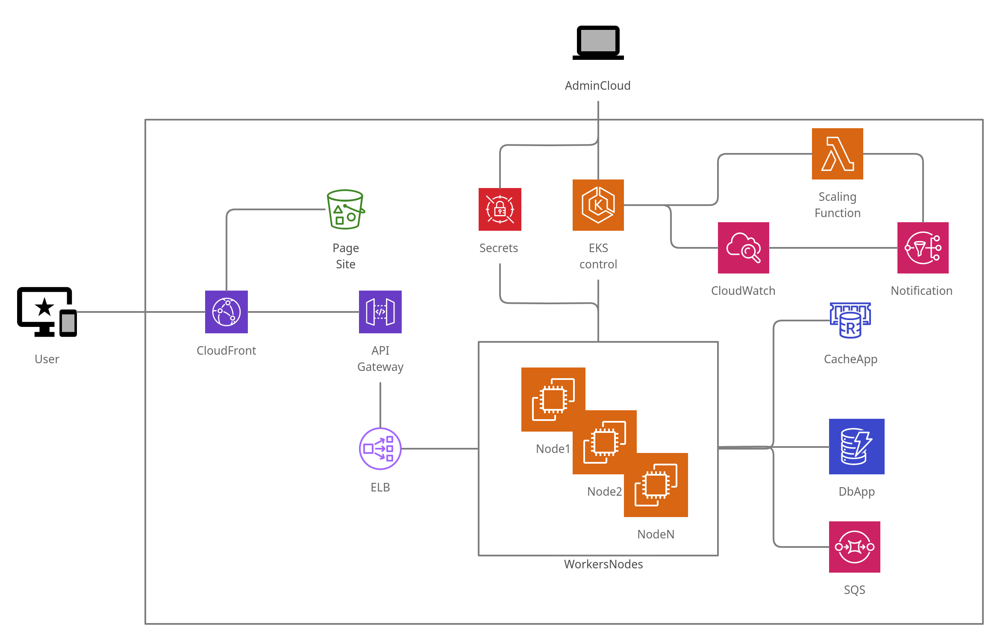

# Prueba de clean code ruleta

## Iniciar por scrips de docker
* primero hay que compilar la aplicacion
* Copiar la compilacion generada, `roulette-0.0.1-SNAPSHOT.war` a la carpeta `./docker/`
* cargar los valores del archivo `./docker/vars.sh` en las variables de entorno
* Ejecutar el archivo `./docker/build.sh`, este paso descarga la imagen de redis y construlle la de la aplicación
* Ejecutar el archivo `./docker/run.sh`, levanta por docker compose redis y la applicación

# Prueba de Arquitectura

* **User** Clientes finales de la aplicación
* **AdminCloud** Administrador de la nube
* **CloudFront** Servicio rápido y seguro de red de entrega de contenido
* **Page Site** Recursos estaticos de la pagina web de los usuarios o clientes finales
* **API Gateway** Publicación de los servicios creados en los nodos de kubernetes
* **ELB** Balanceador de carga entre los POD's creados por aplicacción contenerizada
* **WorkerNodes - Nodes** Instancias EC2 de computo que alojan los diferentes nodos necesarios para la prestación existosa del servicio
* **Secrets** Almacena y comprate "de manera segura" las credenciales necesarias para que las aplicaciones se autentiquen frente a sus recursos
* **EKS Control** Centralización del control de kubernets 
* **Scaling Function** Gestiona el escalamiento de kubernetes para optimizar el estado de los servicios por medio del monitoreo continuo